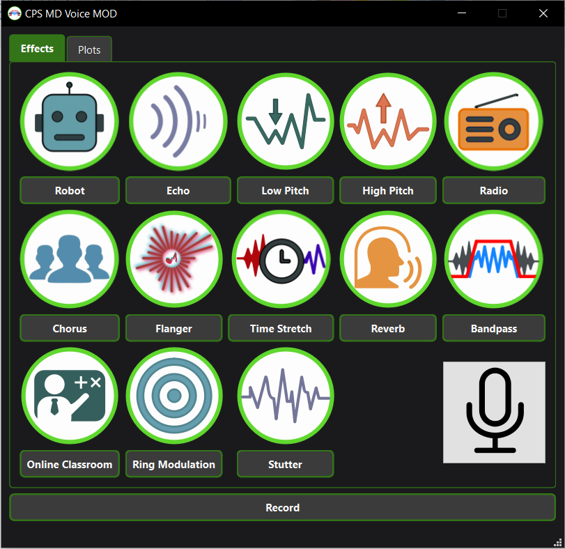
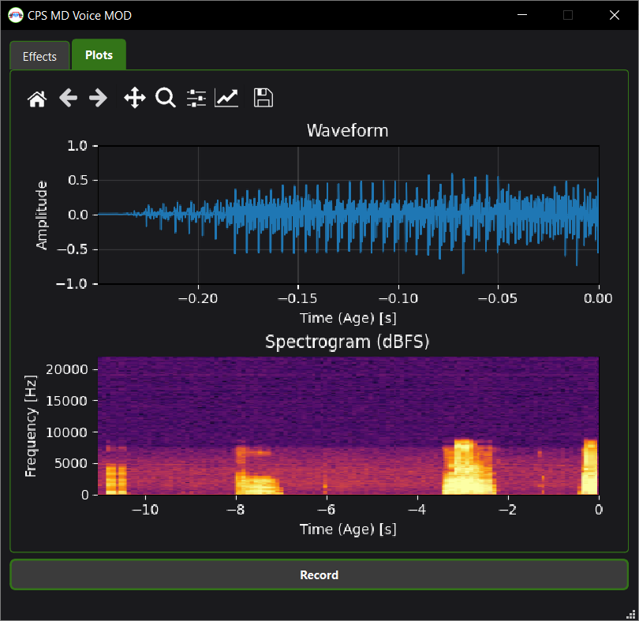

# CPS MD Voice MOD

A Python desktop application for real-time voice effects, waveform and spectrogram visualization, and WAV recording. Developed as a digital signal processing project.

**[Download Windows releases](https://github.com/Hasafah/cps-md-voice-mod/releases)** · **[Project report (Polish)](docs/project-report-pl.pdf)** · **[Build instructions](docs/BUILDING.md)**

## Features

- Capture audio from the default microphone and play processed audio through the default output device.
- Choose one of 13 voice effects; click the active effect again to return to unprocessed audio.
- Mute the microphone from the interface.
- View the processed waveform and scrolling spectrogram.
- Record processed audio to a mono, 16-bit WAV file at 44.1 kHz.
- Use a Qt interface built with PySide6 and Qt Designer.

| Effects | |
| --- | --- |
| Robot | Echo |
| Low Pitch | High Pitch |
| Radio | Chorus |
| Flanger | Time Stretch |
| Reverb | Bandpass |
| Online Classroom | Ring Modulation |
| Stutter | |

## Screenshots

### Effects



### Signal visualization



Screenshots are extracted from the original project report.

## Run the Windows application

1. Open the [Releases page](https://github.com/Hasafah/cps-md-voice-mod/releases).
2. Download the attached Windows application ZIP. The automatically generated **Source code** archives contain the repository, rather than the executable bundle.
3. Extract the entire ZIP to a local folder.
4. Keep `CPSMDVoiceMOD.exe` and the `_internal` folder together, along with every other file included in the bundle.
5. Run `CPSMDVoiceMOD.exe`.

The packaged application includes its Python runtime and bundled dependencies. A separate Python installation is not required. A working microphone and audio output device are required. Headphones help prevent acoustic feedback.

## Run from source on Windows

Use the Python version with which you verified the application. The project report recommends Python 3.10-3.12; this is not a claim that every Python/dependency combination in that range has been tested.

Run these commands from the repository root in PowerShell:

```powershell
git clone https://github.com/Hasafah/cps-md-voice-mod.git
cd cps-md-voice-mod
py -m venv .venv
.\.venv\Scripts\python.exe -m pip install -r requirements.txt
.\.venv\Scripts\python.exe Voice_Changer.py
```

For a published version that provides `requirements-lock.txt`, use that file in place of `requirements.txt` to install the exact dependencies recorded for the release.

`CPS_resources_from_qt.py` is kept in the repository so a fresh clone has the generated Qt resources. After editing the SVG files or the `.qrc` manifest, regenerate it:

```powershell
.\.venv\Scripts\pyside6-rcc.exe CPS_resources_from_qt.qrc -o CPS_resources_from_qt.py
```

The retained resource file and the SVG sources should correspond to the same revision.

## Project files

| Path | Purpose |
| --- | --- |
| `Voice_Changer.py` | Application entry point, Qt GUI, audio worker, and DSP effects |
| `app_stylesheet.py` | Qt palette and stylesheet loading |
| `main_app_window_cps.ui` | Qt Designer interface |
| `darkngreen_palette.qss` | Qt stylesheet; the source and build recipe must use this exact name |
| `CPS_resources_from_qt.qrc` | Qt resource manifest |
| `CPS_resources_from_qt.py` | Generated Python resource module |
| `cps_ikonki/` | Original SVG effect icons referenced by the resource manifest |
| `MIC_ACTIVATED.svg`, `MIC_MUTED.svg` | Microphone status icons |
| `bandpass_kolko.png`, `bandpass_kolko.svg` | Application icon and its editable source |
| `CPSMDVoiceMOD.spec` | Maintained PyInstaller build recipe |
| `docs/` | Build notes, screenshots, and the project report |

Runtime resource paths are retained in their original locations. If they are reorganized, update the Python source, `.ui`, `.qrc`, and `.spec` files together.

## Current scope and limitations

- The application uses the system's default input and output devices.
- It processes mono, 16-bit audio at 44.1 kHz in blocks of 2048 samples.
- One effect is active at a time.
- Pitch and time-stretch effects are experimental educational implementations; audio quality can vary.
- The application plays processed audio to an output device. It does not install or expose a virtual microphone for other applications.
- The executable distribution targets Windows. Other operating systems require separate verification.

## Documentation and development

The [Polish project report](docs/project-report-pl.pdf) explains the interface, architecture, and DSP algorithms. See [BUILDING.md](docs/BUILDING.md) for executable packaging and reproducibility.

To report a problem, open a GitHub issue with your operating system, application version, audio setup, reproduction steps, and any error message.

## License

The original application source code and original application assets are offered under the [MIT License](LICENSE). Third-party libraries retain their own licenses; the Windows bundle must include their applicable notices and license texts.

The full Polish PDF report is excluded from the MIT grant and retains its existing copyright terms; see [docs/LICENSE.md](docs/LICENSE.md). This exception does not revoke the MIT grant for original icons distributed separately as application assets.

## Author

Marcin Drąg · [Hasafah](https://github.com/Hasafah)
